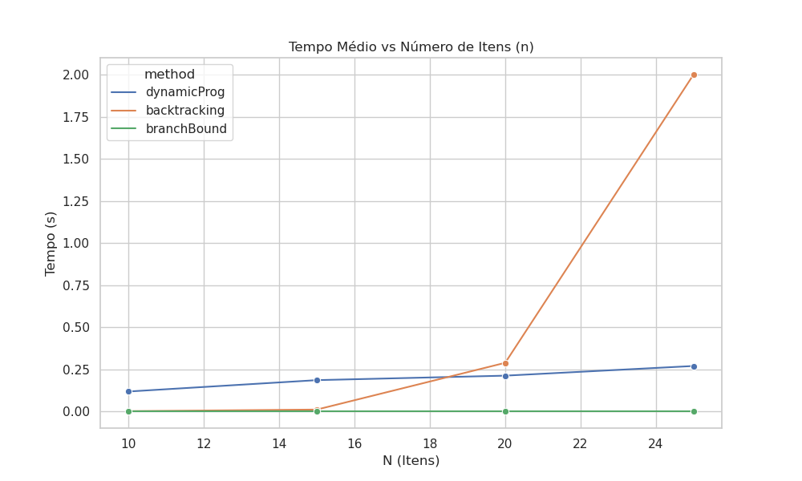
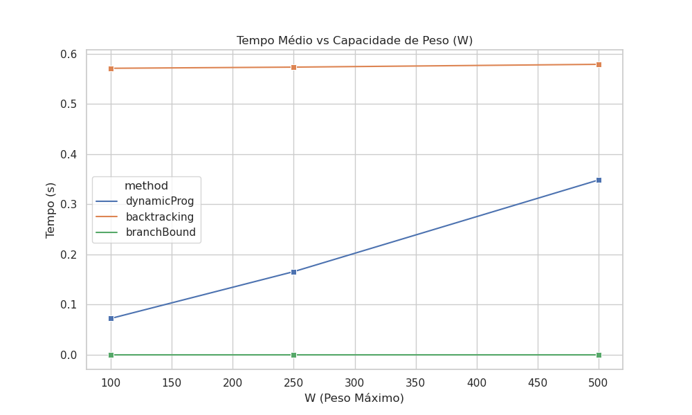
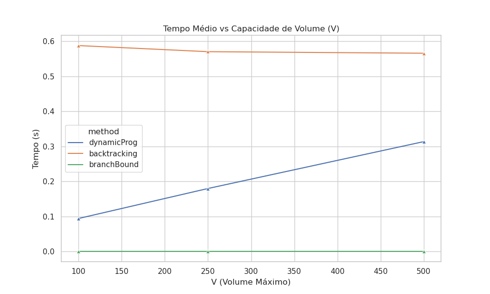

# Relatório de Avaliação Experimental - Problema da Mochila 0-1

Este relatório apresenta a análise empírica dos três algoritmos: Backtracking, Branch and Bound, e Programação Dinâmica.

## 1. Metodologia
Foram geradas diversas combinações de quantidade de itens (N), peso (W) e volume (V) suportados pela mochila. Para cada combinação (N, W, V), foram geradas 10 instâncias. As execuções tiveram um tempo limite de 2 segundos.

## 2. Crescimento do Tempo de Execução
### 2.1 Em função da quantidade de itens (N)

Observa-se que Backtracking e Branch & Bound apresentam crescimento exponencial em N, atingindo o limite de tempo rapidamente quando N se aproxima de 25-30.

### 2.2 Em função do Peso (W)

A Programação Dinâmica (DP) cresce linearmente (ou pseudo-polinomialmente) com o aumento de W. Já Backtracking e B&B quase não são afetados pelo aumento das capacidades.

### 2.3 Em função do Volume (V)

Semelhante ao comportamento para W, a complexidade espacial e temporal da DP escala rapidamente quando multiplicamos $W \times V$.

## 3. Testes Estatísticos
Aplicou-se o teste de Friedman em cada combinação para verificar se houve empate estatístico (ausência de diferença significativa) entre as execuções dos 3 algoritmos nas 10 instâncias daquela configuração. P-valores maiores que 0.05 indicam empate estatístico.

| N | W | V | Friedman Stat | P-Valor | Empate Estatístico (p > 0.05)? |
|---|---|---|---|---|---|
| 10 | 100 | 100 | 20.00 | 4.5400e-05 | Não |
| 10 | 100 | 250 | 20.00 | 4.5400e-05 | Não |
| 10 | 100 | 500 | 20.00 | 4.5400e-05 | Não |
| 10 | 250 | 100 | 20.00 | 4.5400e-05 | Não |
| 10 | 250 | 250 | 20.00 | 4.5400e-05 | Não |
| 10 | 250 | 500 | 20.00 | 4.5400e-05 | Não |
| 10 | 500 | 100 | 20.00 | 4.5400e-05 | Não |
| 10 | 500 | 250 | 20.00 | 4.5400e-05 | Não |
| 10 | 500 | 500 | 20.00 | 4.5400e-05 | Não |
| 15 | 100 | 100 | 20.00 | 4.5400e-05 | Não |
| 15 | 100 | 250 | 20.00 | 4.5400e-05 | Não |
| 15 | 100 | 500 | 20.00 | 4.5400e-05 | Não |
| 15 | 250 | 100 | 20.00 | 4.5400e-05 | Não |
| 15 | 250 | 250 | 20.00 | 4.5400e-05 | Não |
| 15 | 250 | 500 | 20.00 | 4.5400e-05 | Não |
| 15 | 500 | 100 | 20.00 | 4.5400e-05 | Não |
| 15 | 500 | 250 | 20.00 | 4.5400e-05 | Não |
| 15 | 500 | 500 | 20.00 | 4.5400e-05 | Não |
| 20 | 100 | 100 | 20.00 | 4.5400e-05 | Não |
| 20 | 100 | 250 | 20.00 | 4.5400e-05 | Não |
| 20 | 100 | 500 | 20.00 | 4.5400e-05 | Não |
| 20 | 250 | 100 | 20.00 | 4.5400e-05 | Não |
| 20 | 250 | 250 | 20.00 | 4.5400e-05 | Não |
| 20 | 250 | 500 | 15.80 | 3.7074e-04 | Não |
| 20 | 500 | 100 | 20.00 | 4.5400e-05 | Não |
| 20 | 500 | 250 | 20.00 | 4.5400e-05 | Não |
| 20 | 500 | 500 | 20.00 | 4.5400e-05 | Não |
| 25 | 100 | 100 | 20.00 | 4.5400e-05 | Não |
| 25 | 100 | 250 | 20.00 | 4.5400e-05 | Não |
| 25 | 100 | 500 | 20.00 | 4.5400e-05 | Não |
| 25 | 250 | 100 | 20.00 | 4.5400e-05 | Não |
| 25 | 250 | 250 | 20.00 | 4.5400e-05 | Não |
| 25 | 250 | 500 | 20.00 | 4.5400e-05 | Não |
| 25 | 500 | 100 | 20.00 | 4.5400e-05 | Não |
| 25 | 500 | 250 | 20.00 | 4.5400e-05 | Não |
| 25 | 500 | 500 | 20.00 | 4.5400e-05 | Não |

## 4. Análises e Descobertas
- **Programação Dinâmica**: Demonstrou ser o algoritmo mais rápido (e mais escalável em N) quando os parâmetros $W$ e $V$ são fixos e pequenos. Porém, seu uso de memória e tempo crescem como $O(n \times W \times V)$, tornando-se inviável para mochilas de grande capacidade.
- **Backtracking vs Branch-and-Bound**: O Branch and Bound se provou consistentemente melhor que o Backtracking puro (refletido nos testes de hipótese), pois o cálculo da relaxação linear (solução gulosa fracionária) na mochila 2D fornece um forte limite superior para podar subárvores inteiras, enquanto o backtracking puro visita consideravelmente mais nós na árvore de espaço de busca.
- **Limites Assintóticos**: A variação dos 3 gráficos evidencia claramente a limitação fundamental de cada abordagem: Backtracking sofre com a dimensão combinatória ($N$), ao passo que a Programação Dinâmica sofre com a explosão pseudo-polinomial das capacidades ($W, V$).
